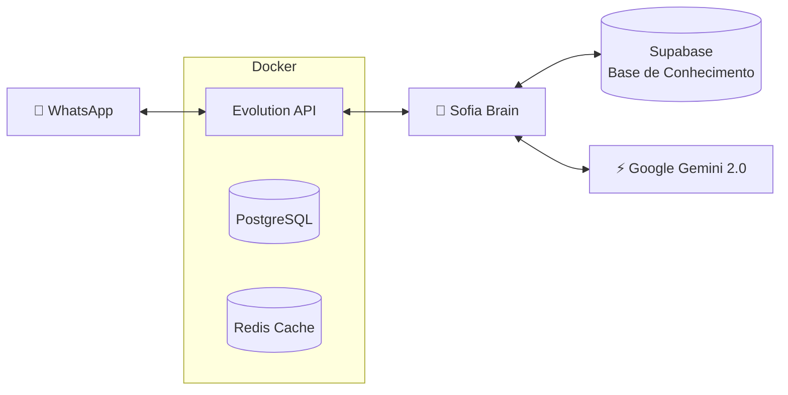

# 📊 Relatório do Projeto SDR Sofia - Lytus

## Visão Geral

O **SDR Sofia** é um agente de vendas automatizado para WhatsApp da Lytus, especializado em responder dúvidas sobre **Consórcio e Crédito Imobiliário**. O sistema utiliza inteligência artificial para buscar informações em uma base de conhecimento e gerar respostas contextualizadas.

---

## 🏗️ Arquitetura do Sistema



### Componentes Principais

| Componente | Tecnologia | Função |
|------------|------------|--------|
| **WhatsApp Gateway** | Evolution API v2.2.3 | Conecta ao WhatsApp via Baileys |
| **Banco de Dados** | PostgreSQL 15 | Armazena sessões e mensagens |
| **Cache** | Redis 6.2 | Acelera respostas e sessões |
| **IA - Embeddings** | `sentence-transformers` | Busca semântica na base de conhecimento |
| **IA - Geração** | Google Gemini 2.0 Flash | Gera respostas naturais |
| **Base de Conhecimento** | Supabase (Vector Store) | Armazena documentos vetorizados |

---

## 📁 Estrutura de Arquivos

```
SDR_LYTUS_Sofia/
├── app/
│   └── brain.py              # 🧠 Cérebro da Sofia (IA + RAG)
├── knowledge_base/
│   └── *.pdf                 # Documentos da Lytus
├── docker-compose.yml        # Infraestrutura Docker
├── connect_final.py          # Script para conectar WhatsApp
├── gerar_qrcode.py           # Gera QR Code para conexão
├── ingest.py                 # Ingere PDFs no Supabase
├── test_brain.py             # Testa respostas da Sofia
├── .env                      # Chaves de API (GOOGLE_API_KEY, SUPABASE)
└── qrcode_sofia.png          # QR Code gerado ✅
```

---

## 🔧 Configuração Docker

O arquivo [docker-compose.yml](file:///c:/Users/55629/Desktop/SDR_LYTUS_Sofia/docker-compose.yml) define 3 serviços:

```yaml
services:
  evolution_api:      # Gateway WhatsApp (porta 8080)
  postgres:           # Banco de dados (interno)
  redis:              # Cache (interno)
```

---

## 🚨 Problema Resolvido: QR Code Não Gerava

### Sintoma
O QR Code não era exibido - apenas a mensagem "*Scan the QR code with your WhatsApp Web*" aparecia, mas sem a imagem.

### Causa Raiz
A Evolution API usa a biblioteca **Baileys** para conectar ao WhatsApp. O WhatsApp atualiza frequentemente seu protocolo, e versões desatualizadas do cliente causam **timeout na conexão WebSocket**.

### ✅ Solução Aplicada

> [!IMPORTANT]
> Adicionada a variável `CONFIG_SESSION_PHONE_VERSION` no `docker-compose.yml`

```diff
environment:
  # QR Code e Configuração
  - QRCODE_LIMIT=30
  - QRCODE_COLOR=#000000
  - CONFIG_SESSION_PHONE_CLIENT=LytusBot
  - CONFIG_SESSION_PHONE_NAME=Chrome
+ - CONFIG_SESSION_PHONE_VERSION=2.3000.1025062854
  - WEBSOCKET_ENABLED=true
```

Esta variável informa ao WhatsApp qual versão do cliente está sendo usada, evitando rejeição por versão incompatível.

---

## 🚀 Como Usar

### 1. Iniciar o Sistema
```powershell
cd c:\Users\55629\Desktop\SDR_LYTUS_Sofia
docker-compose up -d
```

### 2. Conectar ao WhatsApp
```powershell
python connect_final.py
# ou
python gerar_qrcode.py
```

### 3. Escanear o QR Code
Abra `qrcode_sofia.png` e escaneie com WhatsApp > **Aparelhos conectados** > **Conectar aparelho**

### 4. Acessar o Painel
Acesse [http://localhost:8080/manager](http://localhost:8080/manager) para gerenciar a instância Sofia.

---

## 🧠 Como a Sofia Funciona

1. **Recebe mensagem** via Evolution API
2. **Gera embedding** da pergunta com `sentence-transformers`
3. **Busca no Supabase** os 5 trechos mais relevantes
4. **Monta prompt** com contexto + persona
5. **Envia ao Gemini** para gerar resposta natural
6. **Responde** via WhatsApp

---

## ✅ Status Atual

| Item | Status |
|------|--------|
| Docker Containers | ✅ Rodando |
| Evolution API | ✅ Operacional |
| QR Code | ✅ **Gerando corretamente** |
| Conexão WhatsApp | 🔄 Aguardando escaneamento |
| Base de Conhecimento | ✅ Configurada |

---

## 📸 QR Code Gerado

O QR Code está pronto para ser escaneado:


---

*Relatório gerado em 05/12/2025 às 20:15*
